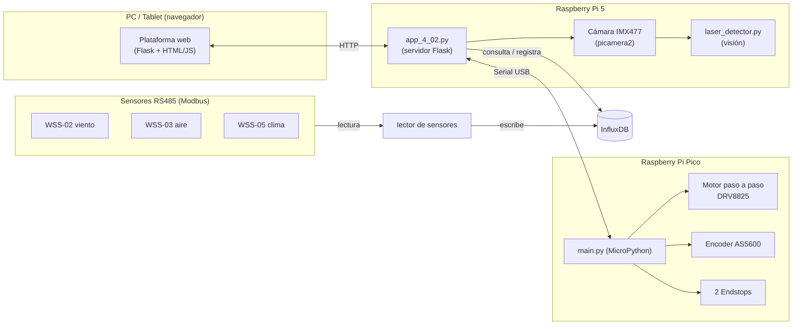
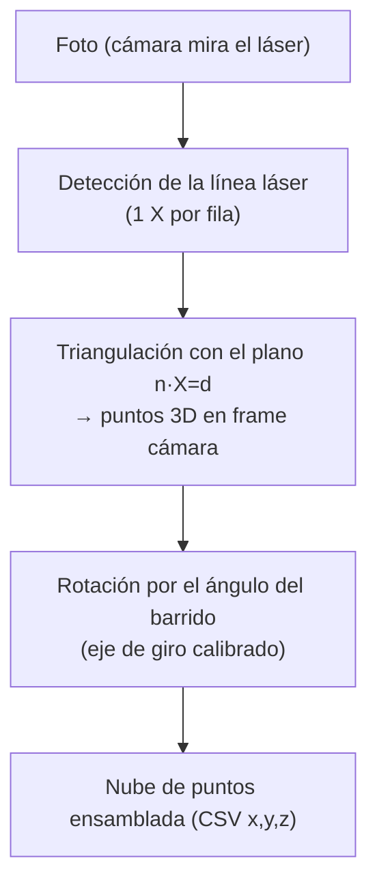
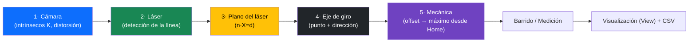
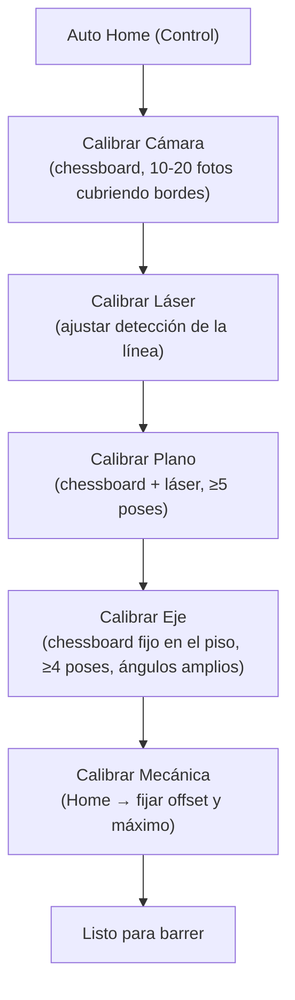
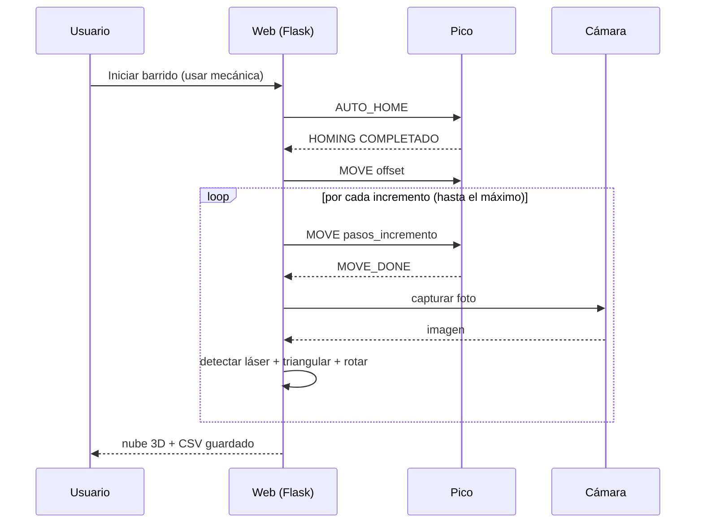
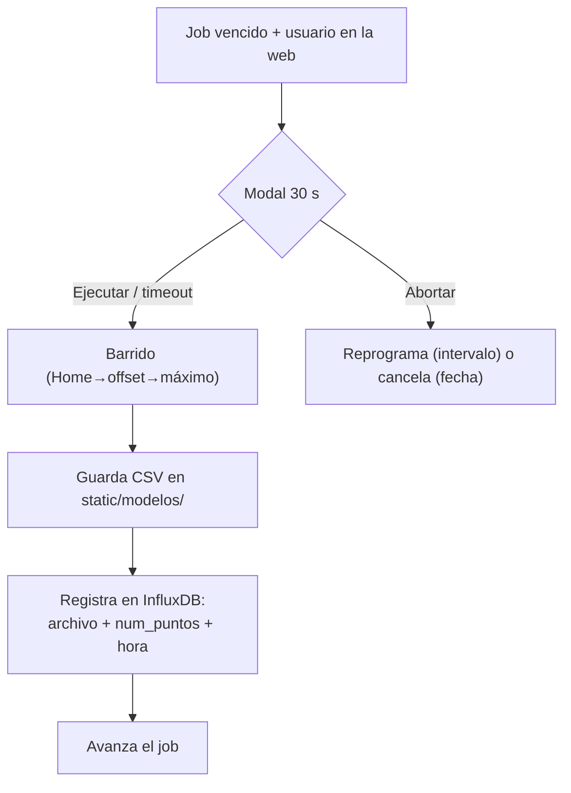
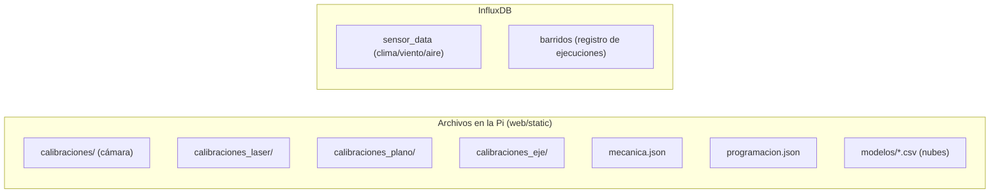

# Manual del Escáner 3D — Mesa LTDIC

Documentación de la plataforma web y del uso del equipo (escáner 3D por
triangulación láser con cámara móvil + sensores ambientales).

> Los diagramas están en **Mermaid**. Se ven directo en GitHub/VSCode (con la
> extensión Mermaid) o pegándolos en https://mermaid.live para exportar PNG/SVG.
> Las fotos/capturas de pantalla agregalas vos donde dice `📷 [captura: ...]`.

---

## 1. ¿Qué es el equipo?

Un escáner 3D que reconstruye la geometría de una superficie (el suelo y objetos
sobre él) mediante **triangulación láser**: una **cámara** y un **láser de línea**
montados en una **barra que bascula** alrededor de un eje. Al barrer, el láser
cruza la escena y la cámara lo ve; con las calibraciones, cada píxel del láser se
convierte en un punto 3D. Además, lee **sensores ambientales** (clima, viento,
calidad de aire) y los grafica.

### Arquitectura

📷 [foto: equipo armado — barra con cámara y láser, mesa/plato]

---

## 2. Geometría (cómo mide)

- La **cámara mira hacia abajo**; el **láser** está a un costado en la misma barra.
- La barra **bascula** alrededor de un **eje** ubicado sobre la cámara (≤ ~110°).
- El láser proyecta una **línea**; la cámara la detecta **fila por fila** (una
  posición X por cada fila Y de la imagen).
- Con el **plano del láser** calibrado (`n·X = d`), cada píxel de la línea se
  intersecta con ese plano → **punto 3D** en el sistema de la cámara.
- Como la cámara se mueve, cada perfil se **rota** según el **eje de giro**
  calibrado y el **ángulo** (sale del conteo de pasos del motor) → se **ensambla**
  la nube completa.

---

## 3. Mapa conceptual: cadena de calibración

**Hay que calibrar en orden.** Cada paso depende del anterior; al cambiar uno, los
siguientes se invalidan.

| Paso | Página | Qué produce | Resolución |
|---|---|---|---|
| 1. Cámara | Ajustes › Cámara | `K`, distorsión (JSON) | fija la resolución de captura |
| 2. Láser | Ajustes › Láser | parámetros de detección (JSON) | — |
| 3. Plano | Ajustes › Plano | plano `n·X=d` (JSON) | misma que cámara |
| 4. Eje | Ajustes › Eje | eje de giro (JSON) | misma que cámara |
| 5. Mecánica | Mecánica | offset + máximo en pasos desde Home | — |

> **Regla de oro de resolución:** al seleccionar el perfil de **cámara**, la
> resolución de captura queda fijada a la de esa calibración, y todo lo demás
> (plano, eje, barrido) captura igual. No mezcles resoluciones.

---

## 4. Mapa del sitio (menú)

```mermaid
flowchart TD
    HOME["🏠 Home<br/>humedad + viento (en vivo)"]
    CTRL["🎮 Control<br/>jog, auto home, loop, stop"]
    DASH["📈 Dashboard<br/>gráficos de sensores + reporte CSV"]
    AJU["⚙️ Ajustes<br/>cadena de calibración"]
    MEC["📏 Mecánica<br/>rango desde Home"]
    PROG["⏰ Programación<br/>barridos por intervalo/fecha"]
    VIEW["👁️ View<br/>nubes de puntos (CSV)"]
    LOGS["🖥️ Logs"]
    CSET["🎥 Camera Setup<br/>resolución"]
    ROI["🔲 ROI Monitor"]
```

---

## 5. Guía de uso paso a paso

### 5.1 Puesta a punto (primera vez o tras cambios mecánicos)

### 5.2 Control (movimiento manual)
- **Pestaña Control:** *Auto Home* (referencia), *jog* Izquierda/Derecha con pasos.
- **Pestaña Loop:** velocidad de captura, *Iniciar Loop* (captura), *Solo Loop*
  (ping-pong para calibración).
- **STOP** siempre visible.

📷 [captura: página Control]

### 5.3 Calibración de cámara
1. Imprimí un **chessboard** y pegalo plano.
2. Ajustes › Cámara › *Crear nueva calibración*.
3. Capturá **10-20 imágenes** moviendo el tablero, **cubriendo bordes y esquinas**
   del encuadre (clave para evitar distorsión residual).
4. Generar → se guarda el JSON con `K`, distorsión, `image_size` y
   `reprojection_error` (idealmente < 0.3 px).
5. **Seleccionar** el perfil (queda activo y fija la resolución).

### 5.4 Calibración del láser
1. Ajustes › Láser › *Crear nueva*.
2. Capturá con el láser sobre la superficie; ajustá los sliders mirando el
   **mapa de calor** y la **línea verde** detectada.
3. Para núcleo quemado: subí `peso_nucleo` y/o `cierre_x`.
4. Switches *Modo barrido (ROI)* y *Vectorizado* para comparar velocidad/resultado.
5. Guardar y seleccionar.

### 5.5 Calibración del plano del láser
1. Chessboard donde el **láser lo cruce**.
2. Ajustes › Plano › *Crear nueva* → capturá **≥5 poses** (inclinaciones y
   distancias distintas).
3. Generar → guarda `n·X=d` y el `rms_residual_mm` (ideal pocos mm).

### 5.6 Calibración del eje de giro
1. Chessboard **fijo en el piso** (no se mueve).
2. Ajustes › Eje › *Crear nueva*.
3. Capturá pose → **jog** unos grados → capturá → repetí (**≥4 poses, bien
   separadas en ángulo**, idealmente cubriendo todo el rango).
4. Generar → guarda eje (punto + dirección). Revisá `axis_offset_mm` (pocos cm) y
   `rms_point_mm` (< 8 mm).

### 5.7 Calibración mecánica (rango desde Home)
1. Menú **Mecánica**.
2. *Ir a Home* (referencia, posición = 0).
3. *Jog* hasta el inicio del barrido → **Fijar offset**.
4. *Jog* hasta el final → **Fijar máximo**.
5. Guardar. Recorrido = `máximo − offset`.

📷 [captura: página Mecánica con la cámara en vivo]

### 5.8 Barrido
- **Test de barrido** (`Ajustes › … › Test`): manual, con opciones de Home+offset,
  pausar streaming, y *Usar rango mecánico*.
- Parámetros: **pasos por incremento** = resolución; nº de capturas ≈
  `recorrido / pasos_incremento + 1`.
- La nube se ve en 3D y se guarda como **CSV** en `static/modelos/`.

### 5.9 Programación de barridos
- Menú **Programación**: crear barridos por **intervalo** (cada N min/h) o **fecha
  puntual**; definir **pasos por incremento** (muestra cuántas capturas saldrían).
- Cuando vence y hay alguien en la web, aparece un **modal con cuenta de 30 s**:
  *Ejecutar ahora* / *Abortar* (a los 0 s ejecuta).
- Al ejecutar: barrido con perfiles + mecánica → guarda CSV y **registra en
  InfluxDB** (archivo + nº puntos + hora).

> Es **confirmación-interactiva**: si nadie está en la web cuando vence, se
> dispara la próxima vez que alguien la abra. No usa cron del sistema.

### 5.10 Dashboard de sensores
- Gráficos **auto-descubiertos** (uno por campo: temperatura, humedad, luz,
  presión, viento, CO₂, PM…); **checkboxes** para elegir cuáles ver;
  **auto-refresh cada 1 min**; selector de ventana.
- **Reporte CSV**: elegí rango de fecha/hora + resolución → descarga.

### 5.11 Obtener la nube de un barrido
- Menú **View** → lista los CSV de `static/modelos/`. Los programados se llaman
  `barrido_prog_AAAAMMDD_HHMMSS.csv`. Click → visualización 3D.
- El archivo crudo está en `web/static/modelos/<nombre>.csv` (columnas `x,y,z`).
- Para correlacionar con la hora exacta: InfluxDB, measurement `barridos`.

---

## 6. Datos y dónde vive cada cosa

| Dato | Dónde |
|---|---|
| Calibraciones | `web/static/calibraciones*/*.json` |
| Rango mecánico | `web/static/mecanica.json` |
| Barridos programados | `web/static/programacion.json` |
| **Nubes de puntos** | `web/static/modelos/*.csv` |
| Lecturas de sensores | InfluxDB `sensor_data` |
| Registro de barridos | InfluxDB `barridos` |

---

## 7. Resolución de problemas (rápido)

| Síntoma | Causa probable | Solución |
|---|---|---|
| Barrido da **0 puntos** | resolución de captura ≠ a la de la calibración | seleccioná el perfil de cámara (re-fija la resolución) |
| **Parábola / bow** en piso plano | distorsión residual / eje o grados-por-paso | recalibrar cámara cubriendo bordes; recalibrar eje con span amplio; verificar reductor |
| Centro del láser **oscuro/quemado** | núcleo saturado a blanco | subir `peso_nucleo` y/o `cierre_x` |
| Nube **en espejo / no cierra** | signo de rotación | invertir `sentido` del barrido |
| Motor **empuja contra el tope** | (firmware viejo) | flashear `main.py` con la seguridad de endstop |
| Dashboard "sin conexión" | falta `influxdb-client` o Influx caído | `pip install influxdb-client`; verificar InfluxDB |

---

## 8. Notas técnicas

- **Optimización 4K:** detección con **ROI** (banda del láser), `scipy` para el
  filtro MAD, y `detect` **vectorizado**.
- **Resolución:** atada a la calibración de cámara (env `INFLUXDB_*` y
  `capture_resolution`).
- **Seguridad endstop (Pico):** `mover_pasos` no avanza hacia un tope ya pisado.
- **InfluxDB:** config por variables de entorno
  (`INFLUXDB_URL/ORG/BUCKET/TOKEN/MEASUREMENT`). El token NO debería quedar en el
  código (usar env var).

---

📷 *Sugerencia: agregá capturas de cada página (Home, Control, Ajustes, Mecánica,
Programación, Dashboard, View) en los lugares marcados `📷 [...]`.*
